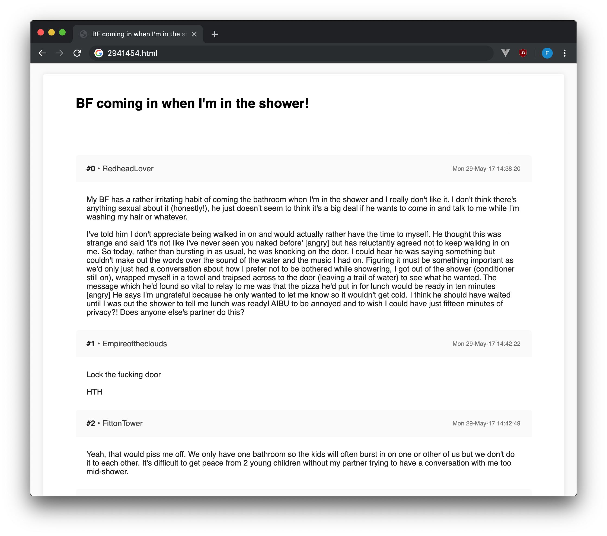

# mn-scraper
Scrapes MumsNet threads into JSON/simplified HTML formats.

## How to install
- Clone the repository using Git
- [Install Node.js](https://nodejs.org/en/download/current/)
- Open a terminal and `cd` into the directory of the cloned repository
- Run `npm install`

## How to use
- To run, execute `node main`;
- Here are the command line options:
	- `-e <email>` Email address [required or use session token]
	- `-p <password>` Password [required or use session token]
	- `-t <token>` Session token [required or use email and password]
	- `-q <query>` The search query [required]
	- `-f <format>` The output format [optional] `(html|json)`
	- `-o <dir>` The output directory [optional] - default is `/output` in the project folder
	- `-n <num>` Limit the number of threads that get scraped

## Example usage
Login using an email and password combination (foo@example.com, bar), and scrape all threads containing "hello":

`node main -e foo@example.com -p bar -q hello`

Login using an email and password combination (foo@example.com, bar), and scrape at most 15 threads containing "hello":

`node main -e foo@example.com -p bar -q hello -n 15`

Login using an email and password combination (foo@example.com, bar), and save the threads in JSON format:

`node main -e foo@example.com -p bar -q hello -f json`

Login using a session token and scrape all threads containing "hello":

`node main -t A5FEBB0480999CC2482F5DDE13371337-n1 -q hello`